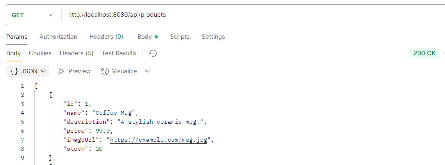
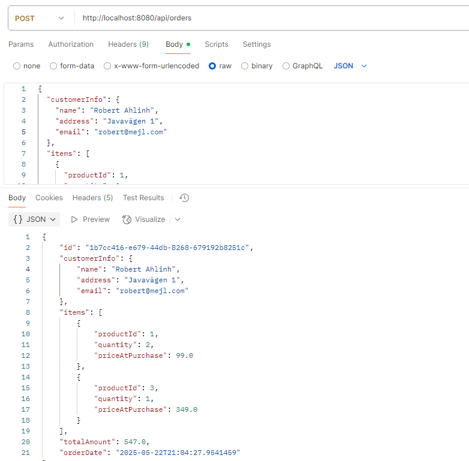
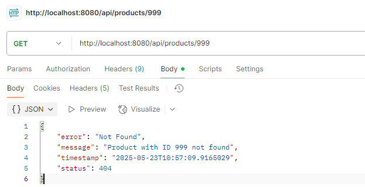
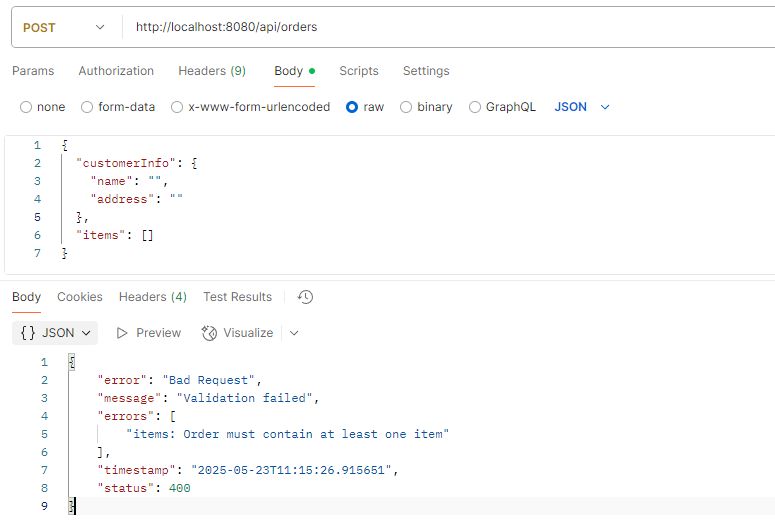

# Webshop Backend – Java & Spring Boot

This is the backend system for a simple webshop project, developed as part of the *Backend Development in Java* course. The application is built using Java and Spring Boot, and it exposes a REST API that can be consumed by a frontend (e.g., React).

## Technologies & Frameworks

- Java 21
- Spring Boot 3.4.5
- Maven
- Spring Web (REST API)
- Bean Validation (Jakarta)
- Spring Boot DevTools (for hot-reloading)
- In-memory storage using Java Collections (List, Map)
- JUnit (unit testing – coming later)

## Getting Started

### Prerequisites

- Java 17+ (Java 21 is used in this project)
- Maven 3.8+
- IntelliJ IDEA (Community Edition is sufficient)
- Git (for version control)

### How to Run

1. Clone project to run locally.
```
git clone https://github.com/RobertAhlin/java-webshop.git
```
2. Open the project in IntelliJ IDEA
3. Run the `WebshopApplication.java` class
4. Open a browser and visit [http://localhost:8080/hello](http://localhost:8080/hello) to test

## Workflow

This section describes the development workflow followed while building the webshop backend.

### 1. Project Setup
- Created a new Spring Boot project using [start.spring.io](https://start.spring.io)
- Added dependencies: Spring Web, Lombok, Validation, DevTools
- Opened the project in IntelliJ IDEA Community Edition
- Initialized Git and connected to a public GitHub repository

### 2. Initial Testing
- Implemented a simple `GET /hello` endpoint to verify the app was running
- Used Postman to confirm the response from the backend

### 3. Product Management
- Created a `Product` class using Lombok to reduce boilerplate
- Built an in-memory `ProductRepository` using a `List<Product>` with sample data
- Added a `ProductService` to separate business logic
- Implemented `ProductController` with two REST endpoints:
    - `GET /api/products` – returns all products
    - `GET /api/products/{id}` – returns a single product by ID
- Verified all product endpoints using Postman  


### 4. Order Management
- Created model classes: `Order`, `OrderItem`, and `CustomerInfo`
- Built `OrderRepository` to store orders in-memory
- Implemented `OrderService` to:
  - Validate that each ordered product exists
  - Calculate the total order amount
  - Generate a unique order ID using `UUID`
  - Set the current date and time as `orderDate`
- Created an `OrderRequest` DTO to handle incoming JSON requests
- Built `OrderController` with a `POST /api/orders` endpoint
- Successfully tested order placement using Postman  


### 5. Error Handling

- Created a custom exception `ProductNotFoundException` to handle cases when a requested product does not exist
- Refactored `ProductService` to throw this exception when a product is not found
- Created a `GlobalExceptionHandler` using `@ControllerAdvice` to catch and return structured error responses
- Implemented a clear JSON error format with timestamp, status code, and message
- Example response for `GET /api/products/999`:
  ```json
  {
    "error": "Not Found",
    "message": "Product with ID 999 not found",
    "timestamp": "2025-05-23T10:57:09.9165029",
    "status": 404
  }
- Successfully tested using Postman  
- 

### 6. Validation & Error Formatting

- Added validation annotations (`@NotBlank`, `@NotEmpty`, `@NotNull`, `@Valid`) to `OrderRequest` and `CustomerInfo`
- Ensured Spring Boot performs input validation on incoming order requests
- Handled validation errors using `@ExceptionHandler` and `MethodArgumentNotValidException`
- Returned clean and readable error messages in JSON format for 400 Bad Request responses
- Example response when submitting an invalid order:
  ```json
  {
    "error": "Bad Request",
    "message": "Validation failed",
    "errors": [
        "items: Order must contain at least one item"
    ],
    "timestamp": "2025-05-23T11:15:26.915651",
    "status": 400
  }

- Successfully tested using Postman  


### 7. Unit Testing

- Added unit tests using JUnit 5 and Mockito
- Created `ProductServiceTest` to verify:
  - A valid product ID returns the correct product
  - An invalid product ID throws `ProductNotFoundException`
- Used mock injection with `Mockito.mock()` to isolate service logic
- Verified all tests pass with `exit code 0`
- 
### 8. OrderService Unit Test

- Created `OrderServiceTest` using JUnit 5 and Mockito
- Verified that:
  - A valid order calculates total correctly and saves it
  - An invalid product ID in the order throws `ProductNotFoundException`
- Mocked both `ProductRepository` and `OrderRepository` to isolate the logic
- All tests passed with exit code 0

### 9. Documentation
- Maintained and updated this `README.md` continuously during development
- Included API endpoint descriptions and run instructions


## API Endpoints (in progress)

| Method | URL        | Description                    |
|--------|------------|--------------------------------|
| GET    | `/hello`   | Simple greeting test endpoint  |
| GET    | `/api/products`        | Returns all available products      |
| GET    | `/api/products/{id}`   | Returns a product by its ID         |
| POST   | `/api/orders`    | Places a new order with customer + items    |

> More endpoints will be added as the project evolves.

## 👤 Author

- Robert Ahlin

## Future planning
